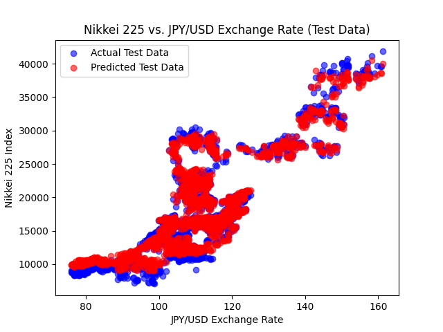

# pytorch
A Model to predict the Nikkei by JPY/USD exchange rate, S&P 500, Oil(CL=F) and Nikkei itself.

Predicted Nikkei 225 at JPY/USD 150, S&P 500 5800, Oil (CL=F) 75: 37033.83

Let's see the result of the model.

